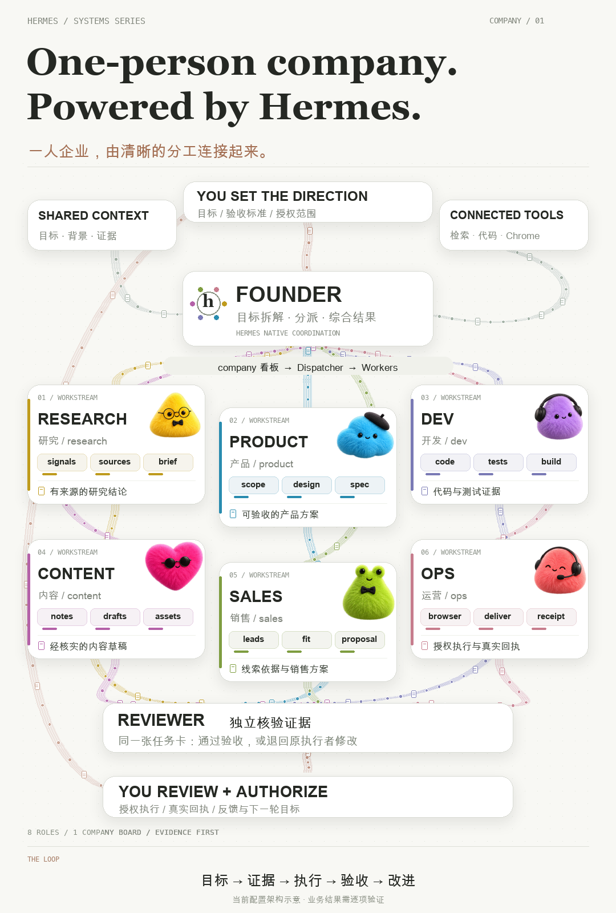
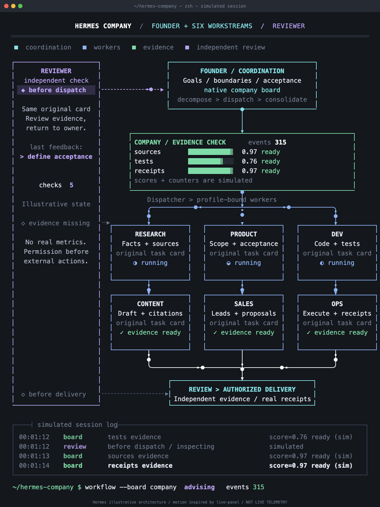
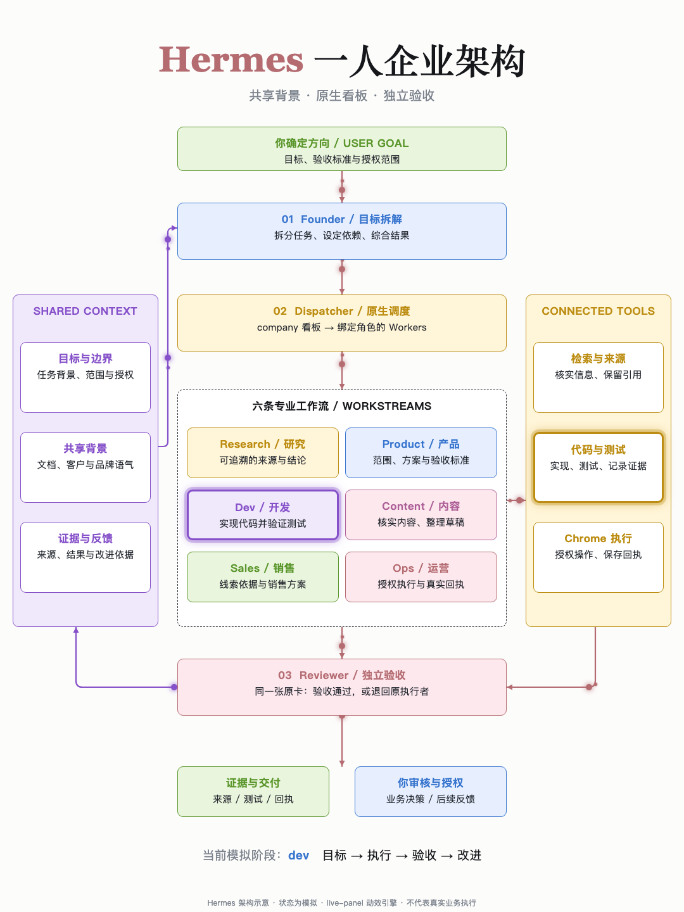

# Architecture Motion Video

Create architecture videos in three styles: plush mascot infographics, dark terminal panels, and light pastel panels. Includes a CLI, a reusable AI skill, editable sources, and original instrumental music.

把系统或一人企业架构制作成视频：**节点从第一帧完整显示，连线持续流动**。面板风格还包含状态变化与联动高亮，深色版带滚动日志。支持独立调整流动速度和密度，无需语音解说。

## 三种风格

| 毛绒角色 · `plush` | 深色终端 · `terminal-dark` | 浅色粉彩 · `light-pastel` |
|---|---|---|
|  |  |  |
| [观看视频](examples/demo.mp4) | [观看视频](examples/terminal-dark.mp4) | [观看视频](examples/light-pastel.mp4) |
| 大标题、毛绒角色、曲线束、圆点与文档流动 | 等宽字、触发侧栏、证据状态条、工作流、计数器与滚动日志 | 编辑式排版、粉彩卡片、共享上下文与工具侧栏、阶段联动高亮 |
| 默认 1080×1600 | 默认 1200×1600 | 默认 1080×1440 |

示例为 **Hermes 一人企业架构**。面板状态、计数器和日志是确定性模拟，不连接真实业务数据；本工具不会安装或配置 Hermes。两种面板使用独立编排的布局，复用 live-panel 的动效引擎。

## 安装与快速开始

需要 **Python 3.10+** 和 **FFmpeg**。两种面板还需要 Chrome 或 Chromium；毛绒风格需要中文及标题字体。仓库不附带这些程序或系统字体。

```sh
git clone https://github.com/xiaoxipanda/architecture-motion-video.git
cd architecture-motion-video
python3 -m venv .venv
source .venv/bin/activate
python -m pip install .

# 三种风格使用同一命令，默认生成 30 秒视频和原创背景音乐
architecture-motion-video render --style plush --out output/plush.mp4
architecture-motion-video render --style terminal-dark --out output/terminal.mp4
architecture-motion-video render --style light-pastel --out output/pastel.mp4
```

省略 `--style` 默认使用 `plush`。每次导出都会检查视频编码、尺寸、时长，并完整解码验证。默认输出为 H.264 / yuv420p MP4、30 fps。

macOS 自动检测标准安装位置的 Chrome，毛绒模板默认使用 macOS 字体。其他系统或自定义安装位置可指定：

```sh
architecture-motion-video render --style terminal-dark --out output/dark.mp4 \
  --chrome /path/to/chrome --ffmpeg /path/to/ffmpeg

architecture-motion-video render --style plush --out output/custom-fonts.mp4 \
  --cn-font /path/to/chinese.ttf --serif-font /path/to/serif.ttf \
  --bold-font /path/to/bold.ttf --mono-font /path/to/mono.ttf
```

中文字体必须包含文案所需字形。面板字体在面板内容 JSON 中配置，不使用毛绒模板的四个字体参数。

## 调整节奏与音乐

```sh
# 降低速度，保留原有密度
architecture-motion-video render --out output/slower.mp4 --speed 100 --spacing 23

# 面板默认速度 80 px/s；缩小间距可以增加光点
architecture-motion-video render --style terminal-dark --out output/denser.mp4 \
  --speed 80 --spacing 120 --duration 20

# 无声视频 / 使用自己的音乐
architecture-motion-video render --out output/silent.mp4 --music none
architecture-motion-video render --out output/custom-music.mp4 --music /path/to/music.wav
```

| 参数 | 默认值 | 作用 |
|---|---|---|
| `--speed` | 毛绒 160；面板 80 | 流动速度，像素/秒 |
| `--spacing` | 毛绒 23；面板 180 | 目标元素间距，像素；越小越密 |
| `--duration` | 30 | 视频时长，秒 |
| `--fps` | 30 | 视频帧率 |
| `--music` | `auto` | 原创纯音乐；`none` 为无声，也可提供音频路径 |

每条路线的元素数量按长度计算，毛绒风格限制为 4–34 个，面板为 1–34 个。面板默认使用稀疏光点与短拖尾。速度和密度独立调整，降低速度不会减少元素。

CLI 默认配乐；直接调用旧的 `scripts/render_hermes_template.py` 时，省略 `--music` 会生成无声视频。

## 配置自己的架构

渲染参数和面板内容使用两类 JSON：

- **渲染配置**：风格、时长、速度、密度、音乐、程序路径等。
- **面板内容配置**：画布、节点、连线、状态机及日志。适用于两种面板风格。

### 深色终端 / 浅色粉彩

```sh
architecture-motion-video init --style terminal-dark --out terminal.json
# 生成 terminal.json（渲染参数）和 terminal-panel.json（架构内容）
# 编辑内容后渲染
architecture-motion-video render --config terminal.json --out output/my-terminal.mp4

architecture-motion-video init --style light-pastel --out pastel.json
architecture-motion-video render --config pastel.json --out output/my-pastel.mp4
```

也可以直接提供架构内容：

```sh
architecture-motion-video render --style light-pastel \
  --panel-config pastel-panel.json --out output/custom-panel.mp4
```

内容格式见 [面板配置说明](references/panel-config-schema.md)。内置布局见 [深色配置](assets/panel-terminal.json) 和 [粉彩配置](assets/panel-pastel.json)。修改节点数量时，应同时调整布局和连线。

### 毛绒角色

```sh
architecture-motion-video init --out render.json
architecture-motion-video render --config render.json --out output/my-plush.mp4
```

毛绒风格的 JSON 配置渲染参数；架构文案、角色和布局在 [Python 模板](scripts/render_hermes_template.py) 的 `roles`、卡片与 `paths` 中修改。默认使用六个工作流角色，附带六个扩展角色供新架构选择。

渲染 JSON 支持 `style`、`duration`、`fps`、`speed`、`spacing`、`music`、`ffmpeg`、`chrome`、`panel_config`、`atlas`、`cn_font`、`serif_font`、`bold_font`、`mono_font`。命令行参数优先；JSON 中的音乐、图集、字体和面板内容相对路径，以该 JSON 所在目录为基准。

## 预览与输出验证

```sh
# 先看封面与关键帧，再决定是否导出完整视频
architecture-motion-video render --style light-pastel \
  --out output/preview.mp4 --poster-only

# 验证已有视频，自动识别尺寸并完整解码
architecture-motion-video check output/pastel.mp4
```

以 `output/pastel.mp4` 为例，辅助文件保存在 `output/pastel-assets/`：封面、关键帧、渲染参数以及自动生成的音乐。面板另外保存 `panel.json`、`panel.html` 和布局检查帧；`panel.html` 可直接在浏览器中打开并持续播放。

`--poster-only` 不输出 MP4、不生成音乐，也不需要 FFmpeg；面板预览仍需要 Chrome。面板渲染会检查 120 余个时刻的布局，并重复定位时间点检查回放一致性。Chrome 使用独立临时配置，不读取用户浏览器登录状态。

已有输出会受到覆盖保护；需要重新生成时，换一个输出名或显式添加 `--force`。自动验证不能替代视觉审阅与实际试听。

## 作为 Skill 使用

完整仓库也是一个 Skill，入口为 [SKILL.md](SKILL.md)。保留脚本、素材、references 与 vendor 目录：

| 使用环境 | 安装目录 |
|---|---|
| Codex | `~/.codex/skills/architecture-motion-video` |
| Hermes | `~/.hermes/skills/architecture-motion-video` |

将完整仓库放入对应目录，或链接已有仓库；目录已存在时先保留现有版本。CLI 的 Python 环境与 FFmpeg / Chrome 依赖仍需按上文准备。

Codex 中可以这样触发：

> 用 $architecture-motion-video 制作 Hermes 一人企业架构视频，使用 terminal-dark 深色终端风格。节点从第一帧显示，连线持续流动，配简单音乐，不要语音解说。

把风格改成 `light-pastel` 可生成粉彩运行面板，改成 `plush` 可生成毛绒角色信息图。Hermes 中可直接点名 `architecture-motion-video` 并说明风格、架构与输出要求。

本 Skill 负责参考分析、核实架构、选择素材、生成可编辑源文件、渲染与验证。独立的 `live-panel` Skill 可以继续使用，无需合并或卸载。

## 素材与项目结构

| 路径 | 内容 |
|---|---|
| `SKILL.md` | 视频制作与验证流程 |
| `cli.py` | `render`、`init`、`music`、`check` 命令 |
| `assets/mascots/` | 两套透明 RGBA 图集，共 12 个角色及纹理区域索引 |
| `assets/panel-*.json` | 两种面板的默认架构内容 |
| `scripts/` | 毛绒与面板渲染、原创音乐合成、视频验证 |
| `references/` | 配置说明、素材用途、图像生成提示词 |
| `vendor/live_panel/` | 面板引擎、许可与来源说明 |
| `examples/` | 三种风格的预览图与演示视频 |

扩展角色包含 Founder、Reviewer、财务、客服、法务和数据分析。其中财务、客服、法务与数据分析为备用设计素材，不表示这些角色已配置到 Hermes。

## 许可与来源

项目采用 [MIT License](LICENSE)。角色素材由 AI 图像生成工具生成，提示词与来源记录保留在 `references/`；原创音乐由附带脚本合成，未使用第三方录音。仓库不附带原参考截图、录屏、私人配置或系统字体。AI 生成素材的来源说明不构成排他权或唯一性保证。

面板复用 MIT 许可的 live-panel 引擎，许可与来源保留在 [vendor/live_panel/NOTICE.md](vendor/live_panel/NOTICE.md)。引擎上游注明动效灵感来自 @thedelost；本仓库未包含上游的第三方视觉复刻示例。
